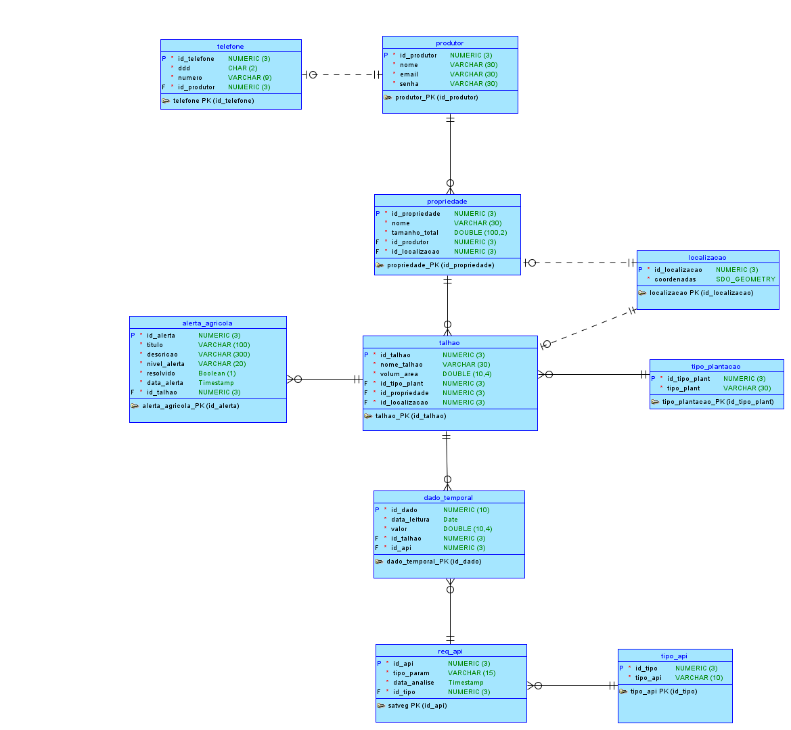
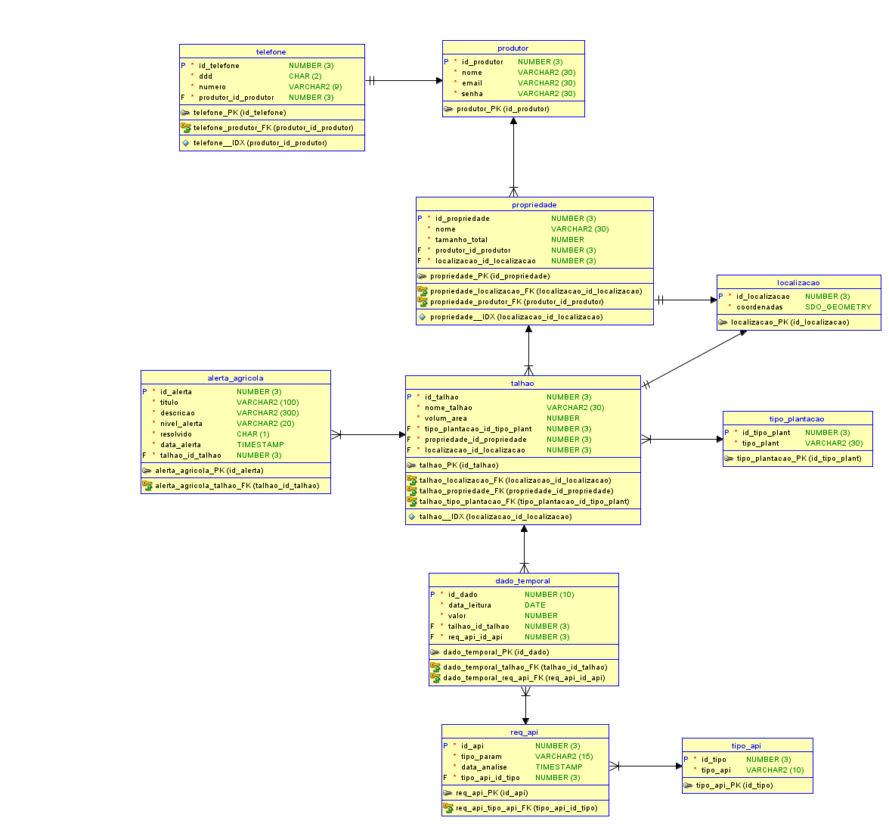

# Terra Nova API

> Global Solution FIAP - Java Advanced

API REST para monitoramento agrícola inteligente, integrando dados de propriedades rurais, talhões, localizações, séries temporais climáticas/vegetativas e alertas automáticos baseados em dados da NASA POWER e da Embrapa SATVeg.

<p>
  
  
  
  
  
</p>

---

## Links da Entrega

| Recurso | Link |
| --- | --- |
| Repositório GitHub | [Repositório Github](https://github.com/Global-Solution-Space/Java-Advanced) |
| Deploy público | [Link Deploy](https://java-advanced-production.up.railway.app/api/) |
| Swagger/OpenAPI local | `http://localhost:8080/swagger-ui.html` |
| OpenAPI JSON local | `http://localhost:8080/v3/api-docs` |
| Coleção Insomnia | [`insomnia.yaml`](./insomnia.yaml) |
| Vídeo de apresentação | [Vídeo Youtube 10 Minutos](https://www.youtube.com/watch?v=6n1A4wfooSE) |
| Vídeo pitch | [Vídeo Youtube 3 Minutos](https://www.youtube.com/watch?v=-ik2puItyfQ) |

---

## Integrantes

| Nome | RM | Turma | GitHub | LinkedIn |
| --- | ---: | --- | --- | --- |
| Enzo Okuizumi | 561432 | 2TDSPG | [EnzoOkuizumiFiap](https://github.com/EnzoOkuizumiFiap) | [Enzo Okuizumi](https://www.linkedin.com/in/enzo-okuizumi-b60292256/) |
| Lucas Barros Gouveia | 566422 | 2TDSPG | [LuzBGouveia](https://github.com/LuzBGouveia) | [Lucas Barros Gouveia](https://www.linkedin.com/in/lucas-barros-gouveia-09b147355/) |
| Milton Marcelino | 564836 | 2TDSPG | [MiltonMarcelino](https://github.com/MiltonMarcelino) | [Milton Marcelino](http://linkedin.com/in/milton-marcelino-250298142) |
| Luna de Carvalho Guimarães | 562290 | 2TDSPG | [lunaguima](https://github.com/lunaguima) | [Luna M. Guimarães](https://www.linkedin.com/in/luna-m-guimar%C3%A3es-1850ab173/) |
| Gustavo Okada | 563428 | 2TDSPG | [Gdev3356](https://github.com/Gdev3356) | [Gustavo Okada](https://www.linkedin.com/in/gustavo-okada-53a3b8359/) |

---

## Proposta da Solução

O **Terra Nova** apoia produtores rurais no acompanhamento de talhões e propriedades por meio de dados temporais vindos de APIs externas. A aplicação consolida dados vegetativos e climáticos, permitindo identificar cenários de risco como baixa vegetação, seca severa, estresse hídrico e risco de alagamento.

### Fluxo principal:

1. O produtor, sua propriedade, seus talhões e suas localizações são cadastrados.
2. O produtor registra uma requisição de API externa em `/api/req-api`.
3. O backend consulta NASA POWER ou SATVeg conforme o tipo informado.
4. Os pontos retornados são persistidos como `DadoTemporal`.
5. O sistema analisa os dados recentes e gera alertas agrícolas quando necessário.
6. Alertas podem ser resolvidos e reabertos via endpoints específicos.

---

## Tecnologias Utilizadas

| Tecnologia | Uso no projeto |
| --- | --- |
| Java 17 | Linguagem principal |
| Spring Boot 4.0.6 | Base da aplicação |
| Spring Web MVC | API REST |
| Spring Data JPA | ORM e persistência |
| JpaRepository | Repositórios de dados |
| Spring Validation | Validação de DTOs |
| Spring HATEOAS | Links nos responses |
| Spring Cloud OpenFeign | Integração com APIs externas |
| Spring Boot DevTools | Produtividade em desenvolvimento |
| Lombok | Redução de boilerplate |
| H2 Database | Banco local em memória |
| SpringDoc OpenAPI | Swagger/OpenAPI |
| Maven | Build e gerenciamento de dependências |
| JUnit 5 / Mockito / MockMvc | Testes automatizados |
| Hibernate Spatial | Mapeamento geométrico (SDO_GEOMETRY) |

---
## 📂 Estrutura Detalhada de Pastas e Validadores (Java)

Abaixo está o mapeamento detalhado dos principais pacotes do sistema, destacando a estrutura interna dos agregados (`controller`, `service`, `repository`, `dto`) e a listagem de todas as validações de regras de negócio customizadas.

```
src/main/java/fiap/com/br/terranova/
├── config/                  # Swagger, CORS, inicializador de seed
├── exception/               # GlobalExceptionHandler e respostas de erro
├── integration/             # Orquestração e integração externa com NASA POWER e SATVeg
│   ├── DadoTemporalIntegrationService.java # Direciona a integração conforme tipo de API
│   ├── FeignErrorUtil.java                 # Extração padronizada de detalhes de erro Feign
│   ├── nasa/                               # NasaPowerClient, NasaPowerDataResponse, NasaPowerIntegrationService
│   └── satveg/                             # SatVegClient, SatVegDataRequest, SatVegDataResponse, SatVegIntegrationService
│
├── produtor/                # Pacote de Domínio: Produtor
│   ├── dto/                 # ProdutorRequest, ProdutorResponse
│   ├── Produtor.java        # Entidade JPA
│   ├── ProdutorController.java
│   ├── ProdutorRepository.java
│   └── ProdutorService.java
│
├── propriedade/             # Pacote de Domínio: Propriedade
│   ├── dto/                 # PropriedadeRequest, PropriedadeResponse
│   ├── Propriedade.java     # Entidade JPA
│   ├── PropriedadeController.java
│   ├── PropriedadeRepository.java
│   └── PropriedadeService.java
│
├── talhao/                  # Pacote de Domínio: Talhão
│   ├── dto/                 # TalhaoRequest, TalhaoResponse
│   ├── Talhao.java          # Entidade JPA
│   ├── TalhaoController.java
│   ├── TalhaoRepository.java
│   └── TalhaoService.java
│
├── alerta/                  # Pacote de Domínio: Alerta Agrícola
│   ├── dto/                 # AlertaRequest, AlertaResponse
│   ├── Alerta.java          # Entidade JPA
│   ├── AlertaController.java
│   ├── AlertaRepository.java
│   └── AlertaService.java   # Contém a inteligência de geração de alertas automática
│
├── telefone/                # Pacote de Domínio: Telefone
│   ├── dto/                 # TelefoneRequest, TelefoneResponse
│   ├── Telefone.java        # Entidade JPA
│   ├── TelefoneController.java
│   ├── TelefoneRepository.java
│   └── TelefoneService.java
│
├── tipoplantacao/           # Pacote de Domínio: Tipo de Plantação
│   ├── dto/                 # TipoPlantacaoRequest, TipoPlantacaoResponse
│   ├── TipoPlantacao.java   # Entidade JPA
│   ├── TipoPlantacaoController.java
│   ├── TipoPlantacaoRepository.java
│   └── TipoPlantacaoService.java
│
├── localizacao/             # Pacote de Domínio: Localização geográfica
│   ├── dto/                 # LocalizacaoRequest, LocalizacaoResponse
│   ├── Localizacao.java     # Entidade JPA
│   ├── LocalizacaoController.java
│   ├── LocalizacaoRepository.java
│   └── LocalizacaoService.java
│
├── reqapi/                  # Pacote de Domínio: Requisições de APIs externas
│   ├── dto/                 # ReqApiRequest, ReqApiResponse
│   ├── tipoapi/             # TipoApi, TipoApiEnum, TipoApiRepository
│   ├── ReqApi.java          # Entidade JPA
│   ├── ReqApiController.java
│   ├── ReqApiRepository.java
│   └── ReqApiService.java     # Orquestra a requisição e delega a integração externa
│
├── dadotemporal/            # Pacote de Domínio: Séries temporais persistidas
│   ├── dto/                 # DadoTemporalResponse
│   ├── DadoTemporal.java    # Entidade JPA
│   ├── DadoTemporalController.java
│   ├── DadoTemporalRepository.java
│   └── DadoTemporalService.java
│
└── validation/              # Validadores de Anotação Customizados (Annotation Validation)
    ├── BrasilCoordenadas.java          # Anotação para limites geográficos do Brasil
    ├── BrasilCoordenadasValidator.java # Validação lógica de latitude e longitude
    ├── EnumValidation.java             # Anotação genérica para validação de valores de Enum
    ├── EnumValidator.java              # Validação de correspondência string -> enum
    ├── UniqueEmail.java                # Anotação para e-mail único do Produtor
    ├── UniqueEmailValidator.java       # Validação de unicidade de e-mail com banco
    ├── ValidPropriedadeArea.java       # Anotação para regras de área de Propriedades
    ├── ValidPropriedadeAreaValidator.java # Validação de limites mínimos de tamanho
    ├── ValidTalhaoArea.java            # Anotação de consistência de área de Talhões
    └── ValidTalhaoAreaValidator.java   # Validação se soma das áreas dos talhões excede a área total da propriedade

```

### Entidades principais:

`Produtor`, `Telefone`, `Localizacao`, `Propriedade`, `TipoPlantacao`, `Talhao`, `ReqApi`, `TipoApi`, `DadoTemporal` e `Alerta`.

### Enums usados:

| Enum | Valores |
| --- | --- |
| `TipoApiEnum` | `SATVEG`, `NASAPOWER` |
| `TipoParam` | `NDVI`, `PRECTOTCORR` |
| `NivelAlerta` | `BAIXO`, `MEDIO`, `ALTO`, `CRITICO` |
| `SimNao` | `S`, `N` |

---

**Padrões Arquiteturais e Design Patterns Implementados:**
- **DTO Pattern (Record):** Separa os objetos de transferência da camada de apresentação das Entidades JPA (segurança e flexibilidade).
- **Facade / Adapter Pattern (Integration):** `DadoTemporalIntegrationService`, `NasaPowerIntegrationService` e `SatVegIntegrationService` isolam os detalhes das APIs externas e entregam dados temporais prontos para persistência.
- **Controller-Service-Repository:** Divisão clássica de responsabilidades. Os controllers recebem requisições e formatam HATEOAS, os services orquestram casos de uso, e os repositories concentram o acesso a dados.
- **Global Error Handling:** Captura unificada de erros (`@ControllerAdvice`), padronizando o formato das respostas (`400`, `404`, `500`) e mapeando violações do Bean Validation (`@Valid`).

### 🎓 Detalhes Acadêmicos de Tecnologias Avançadas

#### 1. Prevenção de Loops de Serialização no Jackson (`@JsonBackReference`)
Ao mapear relacionamentos bidirecionais no JPA (como `Talhao` que contém `DadosTemporais`, e `DadosTemporais` que aponta de volta para `Talhao`), o Jackson (conversor JSON do Spring) pode entrar em recursão infinita ao tentar serializar o grafo de objetos. 
Para resolver isso, adotamos `@JsonBackReference` no lado filho (`DadoTemporal` e `ReqApi`). Essa anotação bloqueia a serialização reversa para o pai, impedindo o estouro de pilha (StackOverflow) e erros de `Connection Reset` no app React Native.

#### 2. Spring Cloud OpenFeign (Declarative Web Client)
Em vez de utilizar classes imperativas como `RestTemplate` ou `WebClient` — que exigem configurações manuais de headers, tratamento de string e conversão manual de objetos —, implementamos o **OpenFeign**. 
Apenas declaramos interfaces Java anotadas com `@FeignClient` e mapeamos os endpoints da NASA POWER e da Embrapa SATVeg como métodos Java locais. A montagem de query, request externo, tratamento de erro Feign e conversão para `DadoTemporal` ficam isolados em services de integração, mantendo o `ReqApiService` pequeno e focado na orquestração do caso de uso.

#### 3. HATEOAS & Modelo de Maturidade de Richardson (Nível 3)
Nossa API foi construída seguindo o **Nível 3 da escala de Richardson (HATEOAS - Hypermedia As The Engine Of Application State)**.
Ao envelopar as respostas em `EntityModel<T>` e `CollectionModel<T>`, os responses JSON não entregam apenas dados puros, mas também um bloco `_links` contendo as ações possíveis a partir daquele estado (ex: links para `self`, `rel`, listagem e remoção). Isso permite que o cliente Mobile navegue pelas APIs de forma dinâmica, orientando-se pelas URIs fornecidas pelo próprio servidor.

#### 4. Custom JPA Validation Constraints
Além das anotações tradicionais do Jakarta Validation (`@NotNull`, `@NotBlank`), criamos anotações customizadas de validação de negócios:
- Validação de Coordenadas Geográficas (Latitude/Longitude válidas).
- Regra de correspondência de área de cultivo (a soma das áreas dos Talhões não pode exceder a área total da Propriedade).
Esses validadores implementam a interface `ConstraintValidator<A, T>`, garantindo que regras complexas sejam validadas em nível de DTO antes mesmo de bater na controller.

#### 5. Hibernate Spatial & Mapeamento SDO_GEOMETRY
A entidade `Localizacao` foi construída utilizando o tipo `org.locationtech.jts.geom.Point`, provido pela biblioteca JTS (Java Topology Suite). Essa abstração permite que o Hibernate Spatial seja completamente "agnóstico" em relação ao banco de dados subjacente: quando em desenvolvimento local, a aplicação interage com o tipo nativo `GEOMETRY` do H2; no ambiente de homologação/produção rodando Oracle Database, o Hibernate traduz o tipo Java automaticamente para a estrutura nativa `MDSYS.SDO_GEOMETRY`. Isso possibilita o uso de indexação espacial, além de suportar operações como cálculo de distância e intersecção entre talhões, aderindo aos requisitos de banco de dados avançado.

---

## Modelagem de Dados

### Modelo Lógico


### Modelo Relacional


---

## Endpoints da API

### Localizações

| Método | Endpoint | Descrição |
| --- | --- | --- |
| `GET` | `/api/localizacoes` | Lista localizações paginadas |
| `GET` | `/api/localizacoes/{id}` | Busca por ID |
| `POST` | `/api/localizacoes` | Cria localização |
| `PUT` | `/api/localizacoes/{id}` | Atualiza localização |
| `DELETE` | `/api/localizacoes/{id}` | Remove localização |

### Produtores

| Método | Endpoint | Descrição |
| --- | --- | --- |
| `GET` | `/api/produtores` | Lista produtores paginados |
| `GET` | `/api/produtores/{id}` | Busca por ID |
| `POST` | `/api/produtores` | Cria produtor |
| `PUT` | `/api/produtores/{id}` | Atualiza produtor |
| `DELETE` | `/api/produtores/{id}` | Remove produtor |

### Telefones

| Método | Endpoint | Descrição |
| --- | --- | --- |
| `GET` | `/api/telefones` | Lista telefones paginados |
| `GET` | `/api/telefones/{id}` | Busca por ID |
| `POST` | `/api/telefones` | Cria telefone |
| `PUT` | `/api/telefones/{id}` | Atualiza telefone |
| `DELETE` | `/api/telefones/{id}` | Remove telefone |

### Propriedades

| Método | Endpoint | Descrição |
| --- | --- | --- |
| `GET` | `/api/propriedades` | Lista propriedades paginadas |
| `GET` | `/api/propriedades/{id}` | Busca por ID |
| `GET` | `/api/propriedades/produtor/{idProdutor}` | Lista propriedades por produtor |
| `POST` | `/api/propriedades` | Cria propriedade |
| `PUT` | `/api/propriedades/{id}` | Atualiza propriedade |
| `DELETE` | `/api/propriedades/{id}` | Remove propriedade |

### Tipos de Plantação

| Método | Endpoint | Descrição |
| --- | --- | --- |
| `GET` | `/api/tipos-plantacao` | Lista tipos paginados |
| `GET` | `/api/tipos-plantacao/{id}` | Busca por ID |
| `POST` | `/api/tipos-plantacao` | Cria tipo de plantação |
| `PUT` | `/api/tipos-plantacao/{id}` | Atualiza tipo de plantação |
| `DELETE` | `/api/tipos-plantacao/{id}` | Remove tipo de plantação |

### Talhões

| Método | Endpoint | Descrição |
| --- | --- | --- |
| `GET` | `/api/talhoes` | Lista talhões paginados |
| `GET` | `/api/talhoes/{id}` | Busca por ID |
| `GET` | `/api/talhoes/produtor/{idProdutor}` | Lista talhões por produtor |
| `POST` | `/api/talhoes` | Cria talhão |
| `PUT` | `/api/talhoes/{id}` | Atualiza talhão |
| `DELETE` | `/api/talhoes/{id}` | Remove talhão |

### Requisições de API Externa

| Método | Endpoint | Descrição |
| --- | --- | --- |
| `GET` | `/api/req-api` | Lista requisições paginadas |
| `GET` | `/api/req-api/{id}` | Busca requisição por ID |
| `GET` | `/api/req-api/talhao/{idTalhao}` | Lista requisições relacionadas a um talhão |
| `POST` | `/api/req-api` | Executa integração externa e persiste dados temporais |
| `DELETE` | `/api/req-api/{id}` | Remove requisição |

Exemplo para NASA POWER:

```json
{
  "tipoParam": "PRECTOTCORR",
  "tipoApiNome": "NASAPOWER",
  "idTalhao": 1
}
```

Exemplo para SATveg:

```json
{
  "tipoParam": "NDVI",
  "tipoApiNome": "SATVEG",
  "idTalhao": 1
}
```

Compatibilidade de parâmetros:

| API | `tipoParam` aceito |
| --- | --- |
| `NASAPOWER` | `PRECTOTCORR` |
| `SATVEG` | `NDVI` |

### Dados Temporais

| Método | Endpoint | Descrição |
| --- | --- | --- |
| `GET` | `/api/dados-temporais` | Lista todos os dados temporais em uma coleção completa, sem paginação |
| `GET` | `/api/dados-temporais/{id}` | Busca dado temporal por ID |
| `GET` | `/api/dados-temporais/talhao/{idTalhao}` | Lista dados temporais por talhão com paginação, padrão `size=100&sort=idDado,desc` |
| `GET` | `/api/dados-temporais/req-api/{idReqApi}` | Lista dados temporais por requisição de API com paginação, padrão `size=100&sort=idDado,desc` |

### Alertas Agrícolas

| Método | Endpoint | Descrição |
| --- | --- | --- |
| `GET` | `/api/alertas` | Lista alertas paginados |
| `GET` | `/api/alertas/{id}` | Busca alerta por ID |
| `GET` | `/api/alertas/produtor/{idProdutor}` | Lista alertas por produtor |
| `POST` | `/api/alertas` | Cria alerta manual |
| `PUT` | `/api/alertas/{id}` | Atualiza alerta |
| `PATCH` | `/api/alertas/{id}/resolver` | Marca alerta como resolvido |
| `PATCH` | `/api/alertas/{id}/reabrir` | Reabre alerta |
| `DELETE` | `/api/alertas/{id}` | Remove alerta |

---

## Regras de Alertas Automáticos

O `AlertaService` analisa dados recentes após cada integração externa:

| Origem | Janela | Condição | Alerta | Nível |
| --- | --- | --- | --- | --- |
| NASA POWER | 3 dias | Chuva acumulada acima de 80 mm | Risco de Alagamento | `ALTO` |
| NASA POWER | 15 dias | Chuva acumulada abaixo de 10 mm | Seca Severa | `CRITICO` |
| NASA POWER | 15 dias | Chuva acumulada abaixo de 25 mm | Estresse Hídrico | `MEDIO` |
| SATVeg | 365 dias | NDVI atual abaixo de 0.2 | Anomalia Vegetativa Severa | `CRITICO` |
| SATVeg | 365 dias | NDVI atual abaixo de 0.4 | Baixo Vigor Vegetativo | `MEDIO` |

O sistema evita duplicar alertas automáticos ativos com o mesmo talhão, título e `resolvido = "N"`.

---

## Tratamento de Erros

As exceções são centralizadas em `GlobalExceptionHandler`.

Formato padrão:

```json
{
  "timestamp": "2026-06-05T17:00:00Z",
  "status": 404,
  "error": "Not Found",
  "message": "Recurso não encontrado.",
  "path": "/api/recurso/99"
}
```

Erros tratados:

- Validação de campos (`400`)
- Regra de negócio (`400`)
- JSON inválido (`400`)
- Violação de integridade (`400`)
- Recurso não encontrado (`404`)
- Erro inesperado (`500`)

---

## Como Executar Localmente

### Pré-requisitos

- Java 17 ou superior
- Maven 3.9+ ou Maven Wrapper

### Passos

```bash
mvn spring-boot:run
```

Ou, se preferir o wrapper:

```bash
./mvnw spring-boot:run
```

No Windows:

```bat
mvnw.cmd spring-boot:run
```

### Acesso Local

| Recurso | URL |
| --- | --- |
| API | `http://localhost:8080` |
| Swagger UI | `http://localhost:8080/swagger-ui.html` |
| OpenAPI JSON | `http://localhost:8080/v3/api-docs` |
| H2 Console | `http://localhost:8080/h2-console` |

Configuração H2:

| Campo | Valor |
| --- | --- |
| JDBC URL | `jdbc:h2:mem:terranova` |
| Usuário | `sa` |
| Senha | vazio |

---

## Como Testar

Rodar a suite completa:

```bash
mvn clean test
```

Validações locais recentes:

```text

./mvnw.cmd test
Tests run: 234, Failures: 0, Errors: 0, Skipped: 0
BUILD SUCCESS
```

A coleção [`insomnia.yaml`](./insomnia.yaml) também pode ser importada no Insomnia para testar os endpoints manualmente.

